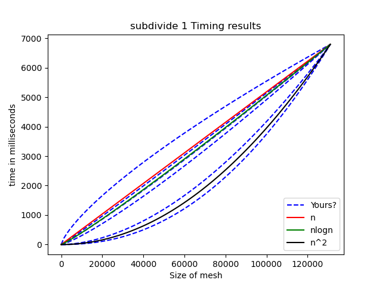

# Python Timer Script

This repository contains a script (and a mesh file) to help measure and visualize the time complexity of your implementation of the mesh subdivision routine. A good implementation should show a a linear/log-linear trend.

To run the script, first compile your mesh code (in release mode!). The build output should contain a `./mesh` executable. Then, run the script with the following command:

```bash
python timer.py -c <path_to_your_mesh_executable> 
```

This should run the script, which will call your mesh executable with a range of input sizes and measure the time it takes to subdivide the mesh. The results will be saved as a lineplot image `time_complexity.png` in the same directory.

